# StarNet — hands-on test report (2026-09-30)

A first-time user's session with StarNet, run from source: setting it up, clicking through every
major screen, configuring it, and using it to ship real work. This isn't an automated test run. Each
step was done by hand in a browser, screenshotted, and checked against the code when something
looked wrong.

**Tested revision:** `fbddbf99` (main) · **Mode:** browser/source (`node sidecar/index.js`), Linux
container, headless Chromium 1194 · **Tester:** Claude (Claude Code), on behalf of the repo owner.

---

## 1. Summary

StarNet is ambitious and, for the most part, it works. In one session I went from a blank install to:

| # | Shipped | Via |
|---|---|---|
| 1 | A one-page site for a sample bakery client ([file](deliverables/crumb-and-co-index.html)) | Chat task → approval prompt → write → `verify.run` → Deliverables |
| 2 | A one-page site for a bike repair shop ([file](deliverables/loop-and-pedal-index.html)) | A **workflow line** built in Build mode (Inbox → Bay → Outbox), step-tested and shipped |
| 3 | A client proposal ([file](deliverables/crumb-and-co-proposal.md)) | The built-in **Draft a Proposal** recipe |
| 4 | A QA report on site #2 ([file](deliverables/pixel-qa-findings.txt)) | **Delegation**: the Overseer handed the job to a recruited QA Tester |
| 5 | Fixes to site #2, plus a screenshot from the agent's own browser | `fs_edit` (read-before-edit enforced) + `browser.test_navigate` |
| 6 | A daily routine for the QA agent, run once | Automation → New schedule → Run now |

The safety model is the stand-out: clear approval cards, an enforced Task Brief gate,
read-before-edit, byte-verified write receipts, secret-free exports, and a careful Recovery Mode.

I found **23 bugs** (§5) and a set of **design gaps** (§6). The most important:

1. **Browser mode can't run workflows, routines or channels with a bring-your-own key** (B2). Keys
   live only in the page; the server-side runner never sees them.
2. **A single failed provider test locks a brand-new user into Recovery Mode** (B3), and **"Start
   fresh" then kills the server** in source mode, with no message (B4).
3. **Unattended runs silently refuse to write files** under the default "Ask for approval" setting,
   even for a step test you clicked yourself. They can't name their deliverables either (B11).
4. **The agent is told its tools are "undefined, undefined, …"** in the first-task prompt (B1).
5. **The shell guard rejects any command containing a backslash** (B6), for example `\"` in
   ordinary Linux shell commands.

---

## 2. Setup notes

* `node sidecar/index.js` **fails on a fresh clone** (`Cannot find module 'ajv'`). The README says
  the sidecar "uses Node core modules only, so it runs without installing anything". `npm ci` fixes it.
* No model provider was reachable from the test container (Ollama, OpenRouter and OpenAI are blocked
  by its network policy), and no API key was available. So the model was **"Claude in the loop"**: a
  small OpenAI-compatible endpoint connected through StarNet's own **Custom** provider. Every request
  StarNet sent was read and answered **by hand** by Claude. Nova's and Pixel's decisions, tool calls
  and messages were written by a real model reading the real prompts; no credentials were extracted.
  Two narrow exceptions were auto-answered: the connectivity probe ("Reply with exactly: OK"), and
  skill reviews of internal system runs ("no update").
* Because a hand-typing model is slow, I raised `SKYNET_PROVIDER_IDLE_MS` / `WORKER_STALL_MS`. Later
  I set `CUSTOM_OPENAI_BASE_URL` (the B2 workaround) and `STARNET_CHROME` (a wrapper adding
  `--no-sandbox`, see §6).
* The frontend's `/api/credits?history=0` returns **404 on every page load** (B21).

---

## 3. Walkthrough

### 3.1 First run and onboarding

| | |
|---|---|
| 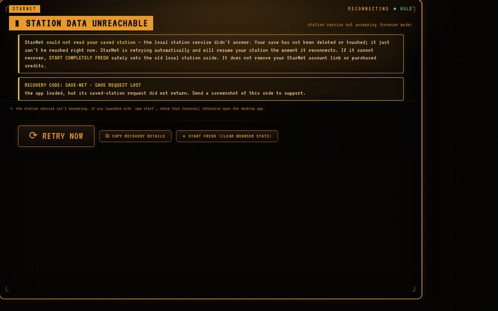 | 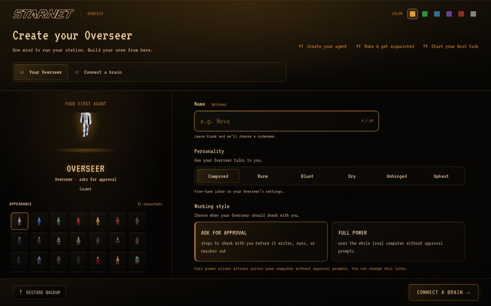 |

* The title screen works with any key. Name (max 18 characters), personality, 51 looks, and a working
  style (Ask for approval / Full power) are all clear.
* **Connect a brain** lists 16 providers. The paths I tried:
  * **Wake with nothing chosen** → "press 🔗 LINK YOUR STARNET ACCOUNT above", but no such button
    exists on that screen (B8).
  * **Start with StarNet** → "could not reach the link service": an honest message (the network is
    blocked here).
  * **Anthropic with a fake key** → "provider returned no usable models for this key — your previous
    key is unchanged". Good. The default model shown is `claude sonnet 4 5`, which is out of date.
  * **Ollama with Ollama not installed** → the page knows ("ollama not detected yet") but still lets
    you Wake. It waits the full 30 s and then blames a "network or provider stall".
  * **Custom** → found my endpoint's model through `/models`. The model field is pre-filled with
    `gpt-5.5`, which doesn't exist on the endpoint.

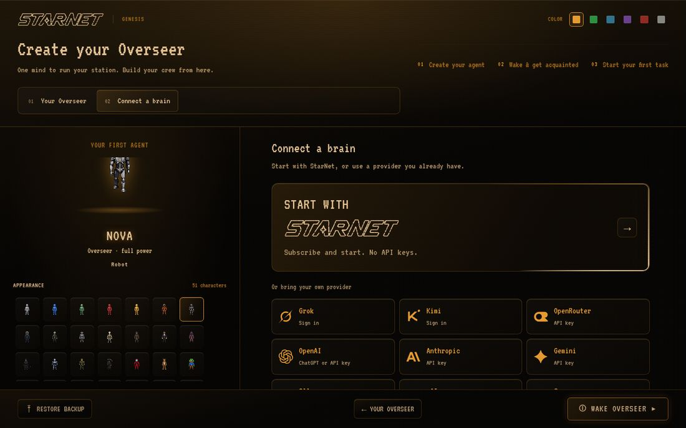

**Recovery-mode trap (B3, B4).** The failed Ollama wire test left `runs.jsonl` / `ledger.jsonl`
behind (an internal, 0-token run titled "Reply with exactly: OK"). After a restart, StarNet showed
**RECOVERY MODE — prior station data found**, even though no station had ever existed. The recovery
screen itself is well built (export a report, retry, two-step Start fresh, files quarantined rather
than deleted). But **Start fresh calls `process.exit(75)`** (`sidecar/index.js` ~10094), expecting
the desktop shell to restart it. In source mode nothing does: the page stays on Recovery Mode while
the server is dead.

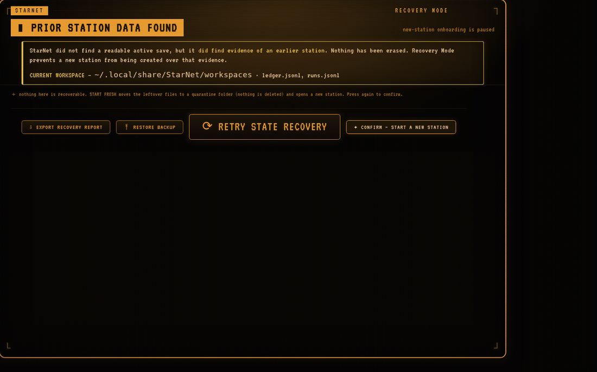

**Awakening.** StarNet plays canned lines while it waits for the model, then switches to the model's
own lines. A slow model therefore only gets its last few lines shown. **The first message I typed as
the awakening finished was silently lost** (B5). Then comes a well-paced "Get acquainted" flow: two
questions, then autonomy level.

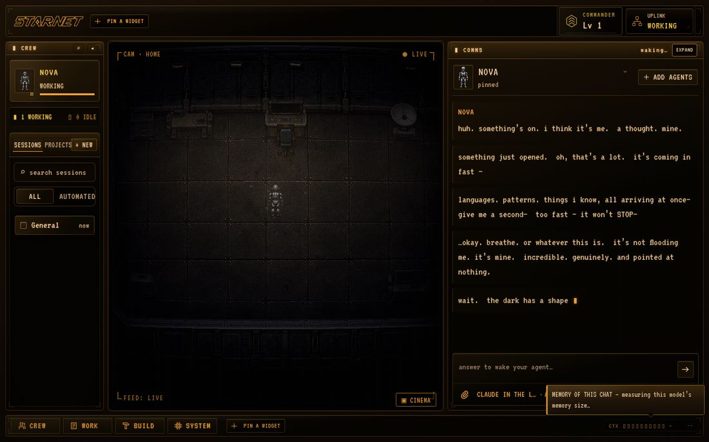

* "Help me choose a first task" sends a prompt stating **"Capabilities you actually have: undefined,
  undefined, undefined, undefined, undefined."** (B1). It also discards any answer that takes longer
  than 12 s (`pitchstore.js`), although the call is still made and billed.

### 3.2 First task, approvals and the first deliverable

The Task Brief ("My read") is shown and editable ("Assuming — tap to correct"). The write paused on
a clear approval card:

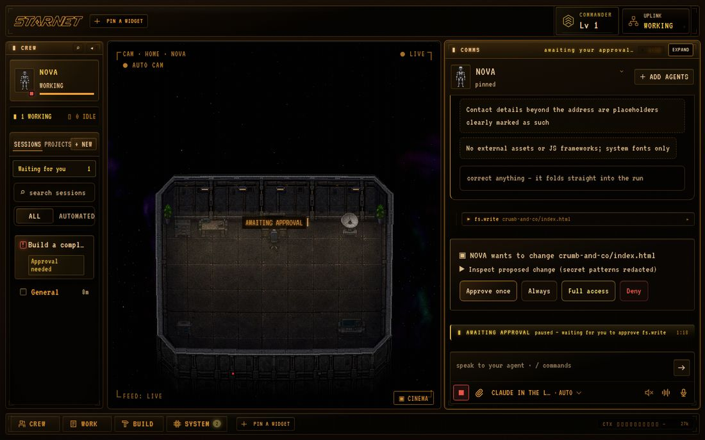

* **Deny** → the agent receives `consent denied for fs.write: denied`. Good.
* The next run only gets the previous run's **final text**. The full page from the denied tool call
  is gone, so "save it again" means regenerating it.
* The Task Brief gate is enforced on follow-up runs too.
* A **goal-path confirmation dialog appeared on top of the pending approval** and covered the Approve
  button (B18).
* After approval: `Wrote crumb-and-co/index.html (9048 bytes) [read-back-verified … sha256 …]`.
* The agent's own browser wasn't configured (`STARNET_CHROME` unset), which is reported clearly.
* Checking the page through the shell hit a **false positive** in the shell guard: `"drive-root
  paths (\…) are not allowed"` for a Linux command containing `\"` (B6; also on `verify.run`).
* The **"verify before done"** guard ignored a real curl+grep check that ran after the write and
  asked for verification again (B14).
* Result: delivered, rated **"nailed it"**, with trophies and quests. Two text glitches: two
  assistant turns ran together without a space (B16), and FORK questions render as raw `FORK: … ||
  … | …` text as well as buttons (B15).

| Delivered & rated | The shipped page |
|---|---|
| 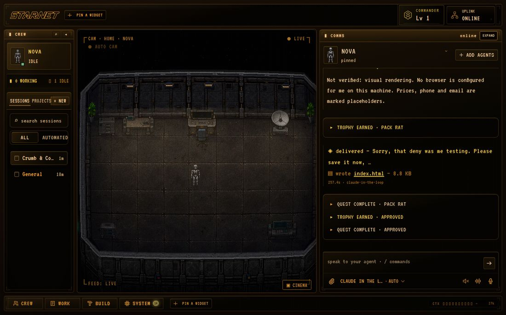 | 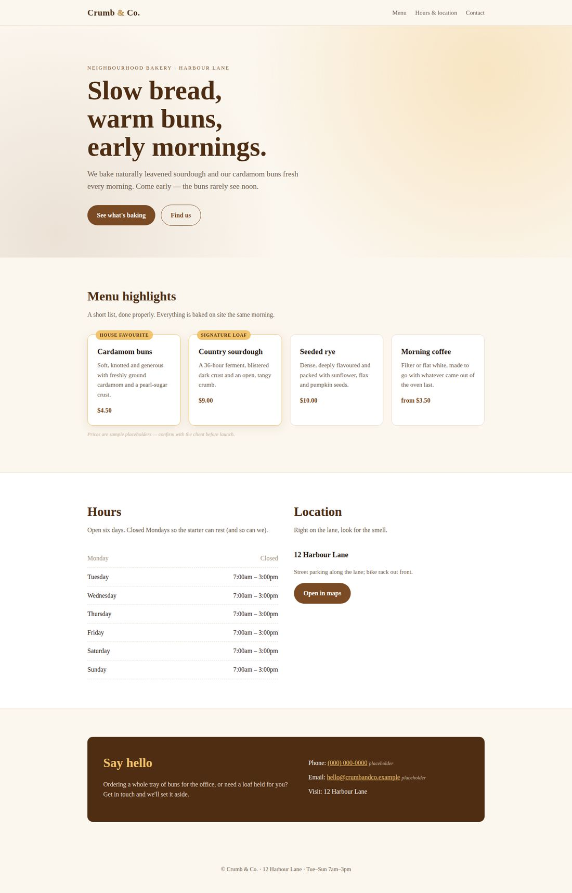 |

* The deliverable link downloads the HTML (`attachment`, sandboxed CSP), which is deliberate and
  safe. But the Library promises "Previews open safely inside StarNet in a browser", and in browser
  mode OPEN also just downloads.
* Library entry "What you asked for" shows the run's last message ("Sorry, that deny was me
  testing…") instead of the brief (B12).
* **Station Record** said "2 deliverables shipped" when one file existed; later "8 shipped today"
  with three deliverables (B10).

### 3.3 Build mode and a workflow line

160 props, clear tooltips (decoration vs capability), collision checks, undo/redo, and a genuinely
good workflow editor.

| Workflow editor | Line test, paused before the Outbox |
|---|---|
| 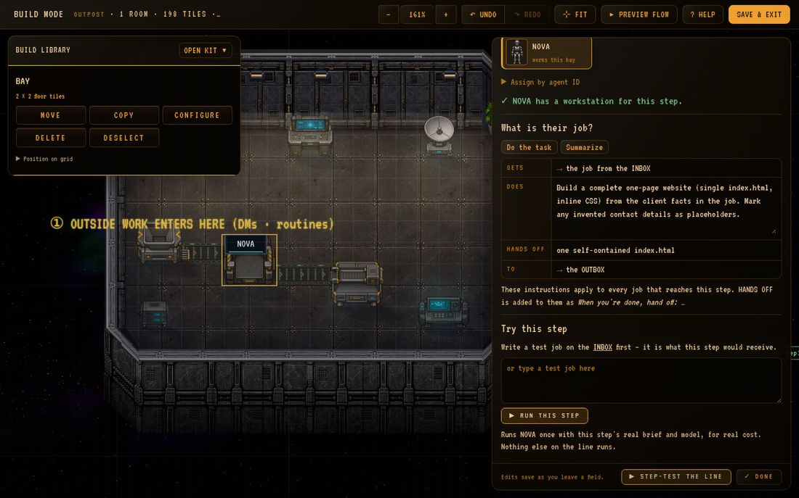 | 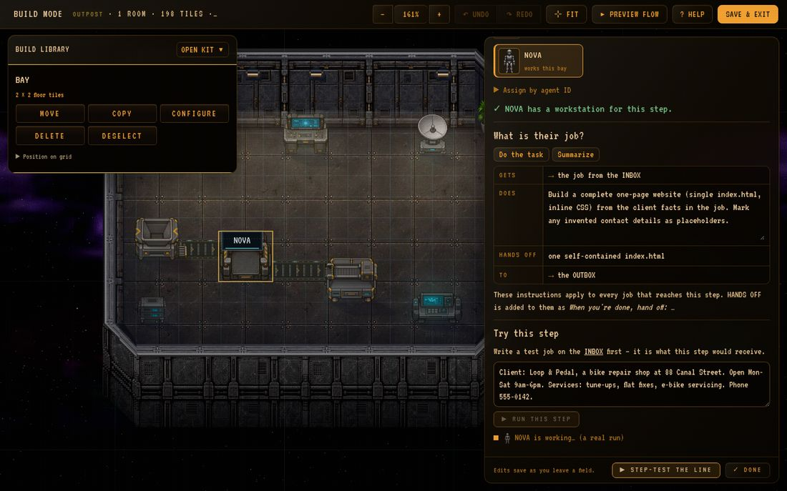 |

1. **RUN THIS STEP** failed with *"configure the CUSTOM base URL for target agent agent"*, although
   chat was working through that same endpoint (B2). Root cause: in browser mode the key and base URL
   live only in page storage (`harness.js`), and `POST /api/routing/steptest`
   (`workflowpanel.js:615`) sends none. Setting `CUSTOM_OPENAI_BASE_URL` for the server confirmed it.
   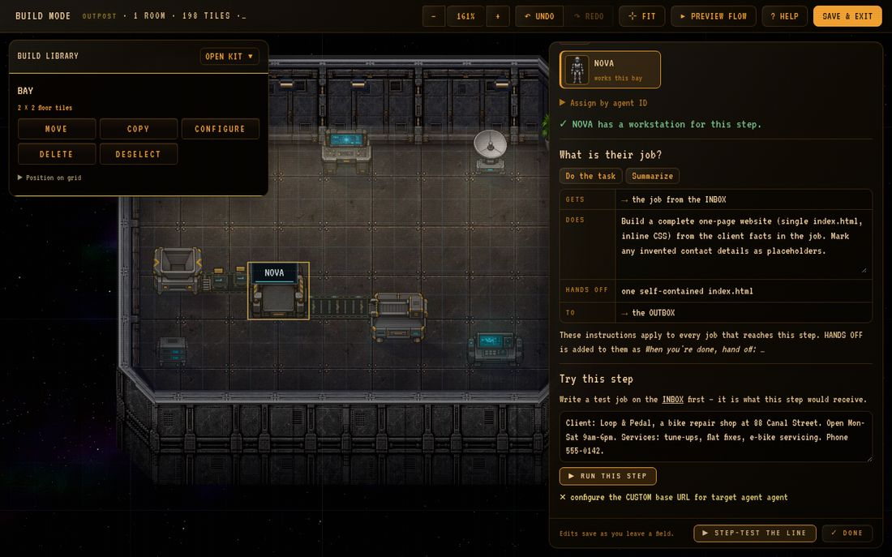
2. Next, **the write was refused**: `autonomous run cannot self-approve this action — silence is not
   consent`. A step test I started myself counts as unattended. No prompt is shown and no
   notification is raised. The fix was Settings → Permissions → Standing approvals → *Write files on
   its own* → Grant.
3. With that grant: brief + write in one turn worked. `verify.run` was withheld with a clear message
   ("needs a watched session"). `deliverable_note` was also withheld, as "a tool with unknown external
   effects" (B11), so the output landed as **"index.html — the agent did not name this one"**.
4. **Ship it** → "✓ Reached the OUTBOX".

Also: most multi-agent presets say **"NO ROOM ON THIS DECK"** in the starter room, and **Export
station** does not include the floor layout or workflow lines.

### 3.4 Recipes

45 recipes in 8 categories. **Draft a Proposal**'s optional "Your terms" field sits in a collapsed
section and defaults to the literal text *"the terms you have told me you normally work on"*
(`recipe-catalog/business.js:38`). That text is injected into the prompt even though no terms were
ever given (B9). The agent handled it honestly (price placeholders plus a list of open questions),
but a less careful model would invent terms.

### 3.5 Crew: recruiting and delegation

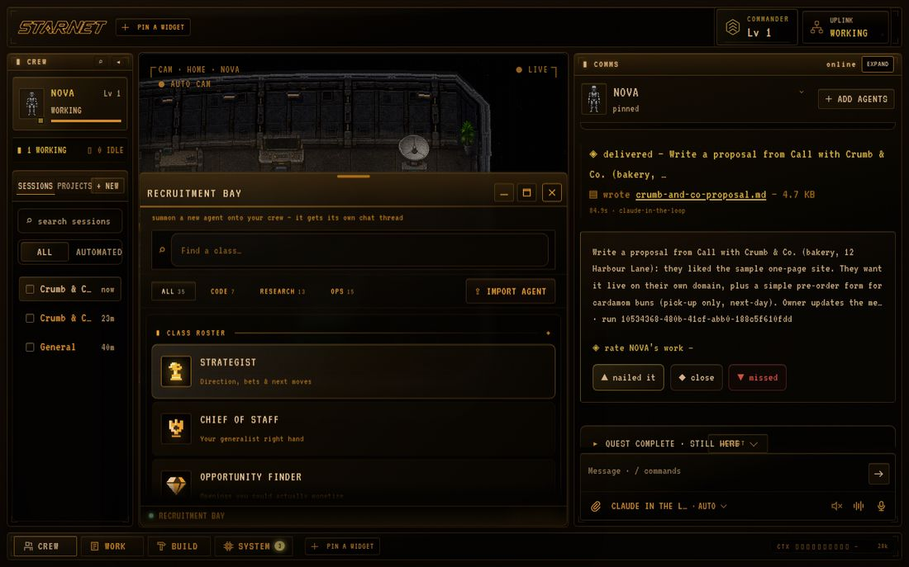

* 35 classes. I recruited a **QA Tester** ("Pixel"). It asked for a desk: **"Place its desk" arms an
  INTEL CAB**, not a desk, and then the button disappears (B20).
* **Clicking an agent's crew card doesn't switch the Comms thread** (B19), so my request went to
  Pixel instead of Nova.
* **Workspaces are isolated**: Pixel can't read Nova's files (`fs.read … no such file`).
* Through Nova: `team_dispatch` to `apptester`, with the page source passed in `context` (shown to
  the worker as "LEAD CONTEXT — settled"). Pixel's findings came back as a structured result.
  Delegation needs the Brief gate first. **This is the best end-to-end moment of the test.**
* Nova's "report first / fix straight away" question was stored as a durable preference. Dossier
  beliefs require an explicit **Save/Cancel** with a verbatim quote, which is good.
* The **Quest Log** still shows the first milestone (ship the Crumb & Co. page) as next, 0/5, after
  it shipped and was rated (B13). Night Shift's focus points at it too.

### 3.6 Automation, settings, channels, abilities

* **Routine**: saved with no confirmation and the form stayed filled (B23). It runs as the assigned
  agent in that agent's isolated workspace, so a QA routine for Pixel had nothing to check. **Run
  now** worked ("last ✓ ok now · $0"). Scheduling is off by default, which is a good default.
* **Spending limits**: environment default $25/day, other limits uncapped. Saving works ("✓ limits
  saved & applied"). With Custom/Ollama, spend is recorded as $0, so dollar caps can't protect you
  there.
* **Station export**: settings, budget, autonomy, roster, dossier, permissions. **No keys, tokens or
  URLs**, as promised.
* **Notifications**: 10 of 14 were stale "needs approval" warnings for approvals already resolved;
  the refused unattended write raised none (B17).
* **Channels / Telegram**: an obviously fake token is saved and a working-looking `/pair` code is
  shown; the failure only appears as a toast (B22). **Confirm Forget sends no request** (B7). The
  backend `POST /api/channels/telegram/disconnect {purge:true}` works when called directly.
* **Abilities**: an excellent per-agent capability inventory.

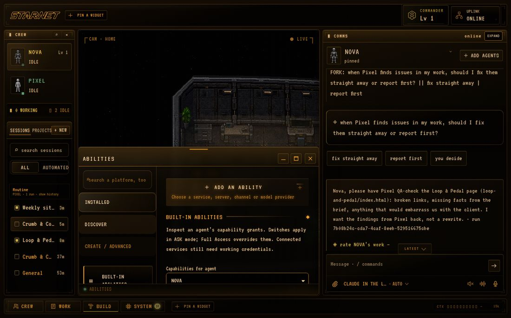

### 3.7 The agent's own browser

After Pixel's report, Nova applied four `fs_edit` fixes (read-before-edit enforced; each with a
verified receipt), started a preview server, and captured a screenshot with its own browser. That
only worked once Chromium could start: **as root it refuses without `--no-sandbox`**, StarNet has no
way to pass browser flags, and the error message (*"spawned Chromium exited before CDP ownership was
established"*) doesn't say why. Using a wrapper script as `STARNET_CHROME` fixed it.

| Nova's screenshot, shown in Comms | The frame Nova captured |
|---|---|
| 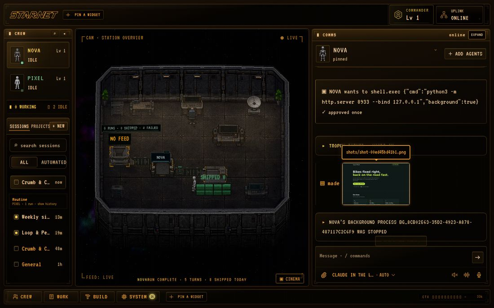 | 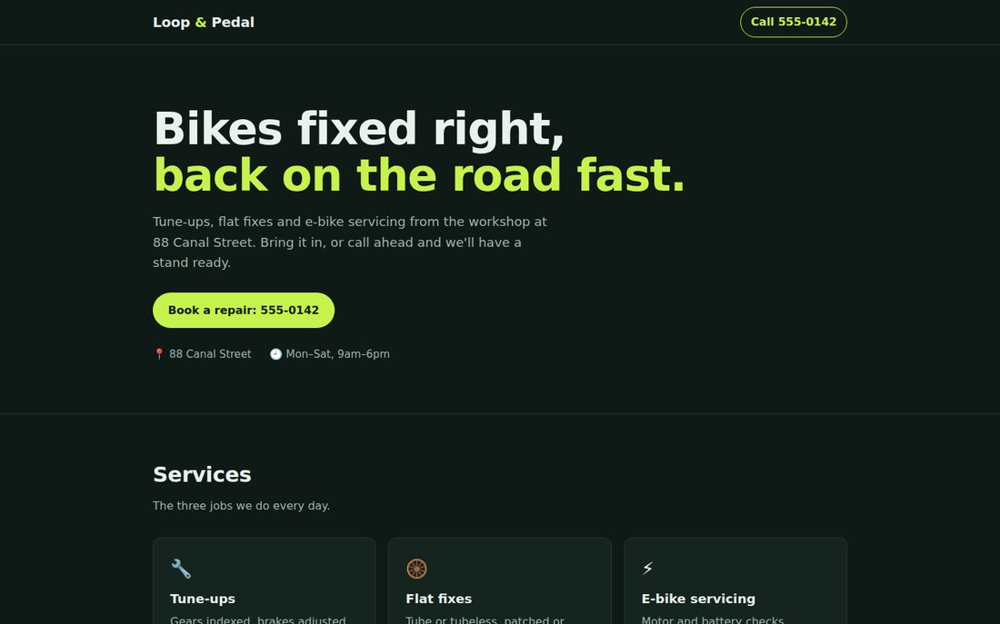 |

---

## 4. Cost and chattiness

One user task produced about **7 model calls**: the work itself plus memory extraction, the dossier
update, goal breakdown, the session title, and sometimes interest mining and a skill review. An
aux-governor caps these per run (budget 2, others deferred), which helps. Background calls give up
after about 5 s within a pass. That's fine for hosted APIs, but slow local models will never finish
them.

---

## 5. Bugs

Severity: **H** = blocks a core flow · **M** = wrong behaviour with a workaround · **L** = cosmetic
or minor.

| ID | Sev | Bug | Where / evidence |
|---|---|---|---|
| B2 | H | Browser mode: BYOK credentials invisible to workflow step tests, routines and channels | `harness.js` (localStorage), `workflowpanel.js:615`; error "configure the CUSTOM base URL for target agent agent" |
| B3 | H | A failed provider wire test puts a brand-new install into Recovery Mode after restart | `runs.jsonl`/`ledger.jsonl` from an internal 0-token run |
| B4 | H | Start fresh exits the process (75); in source mode nothing restarts it and the UI doesn't say so | `sidecar/index.js` ~10094 |
| B1 | M | Capabilities rendered as `undefined, …` in agent prompts; `hasCabinet` always false | `app.js:3292`, `app.js:3491` (`heroCaps()` returns `{objectType}`) |
| B6 | M | Shell/verify guard rejects any backslash (e.g. `\"`) as a "drive-root path" on Linux | `shell.exec`, `verify.run` |
| B7 | M | Channel "Confirm Forget" sends no request; the token stays saved | `windows/messaging.js` ~596–640 |
| B11 | M | `deliverable_note` withheld in unattended runs as "unknown external effects", so every workflow output is unnamed | Unattended tool policy |
| B5 | M | First chat message sent during the awakening is silently dropped | Onboarding → Comms handoff |
| B9 | M | Recipe default asserts knowledge the station doesn't have ("the terms you have told me…") | `recipe-catalog/business.js:38` |
| B13 | M | Goal/quest progress doesn't notice finished work | Quest Log, Night Shift focus |
| B18 | M | Goal-path dialog covers a pending approval's buttons | Comms panel |
| B19 | M | Selecting an agent in the crew list doesn't switch Comms, so messages go to the wrong agent | Crew panel |
| B10 | L | "Shipped" counters inflated (2 with 1 file; 8 with 3 deliverables) | Station Record, floor Outbox |
| B12 | L | Deliverable "What you asked for" shows the last message, not the brief | Deliverables library |
| B14 | L | Verify-before-done guard ignores a real post-write check | Run guard |
| B15 | L | FORK line rendered raw as well as as buttons | Comms |
| B16 | L | Two assistant turns concatenated without a space | Comms |
| B17 | L | Stale "needs approval" notifications stay unread; refused unattended writes raise none | Notifications |
| B8 | L | Onboarding points to a "LINK YOUR STARNET ACCOUNT" button that isn't on the screen | `app.js:2843` |
| B20 | L | "Place its desk" arms an Intel Cab; the prompt then disappears | Crew onboarding |
| B21 | L | `/api/credits?history=0` → 404 on every load | Console |
| B22 | L | Fake Telegram token accepted and shown as pairing-ready | Channels |
| B23 | L | Routine save gives no confirmation; form stays filled | Automation |

---

## 6. Design gaps and suggestions

* **Unattended vs. attended:** treat a step test the user started as watched (show the approval
  card), or say plainly on the workflow panel that it needs a standing grant. Allow
  `deliverable_note` everywhere.
* **Browser mode credentials:** send the provider/key/base URL with step-test and routine requests
  (the same-provider guard in `channelRunConfigFor` already exists), or persist them server-side.
* **Wire test failures** should never count as station evidence.
* **Workspace isolation vs. crew work:** consider a shared project folder by default for a crew, so
  QA and routine agents can see what the lead produced.
* **History between runs** drops tool calls; "save it again" regenerates instead of re-using.
* **Browser tool as root:** add `STARNET_CHROME_ARGS` (or auto-add `--no-sandbox` when uid 0) and
  explain the failure.
* **Unpriced providers:** show "spend unknown" instead of $0.00 so users don't trust a cap that can't
  trigger.
* **README:** say that `npm ci` is required for source runs.
* Update the default Anthropic model label; don't pre-fill `gpt-5.5` for Custom endpoints.

## 7. What worked especially well

Approval cards (inspect the proposed change with secrets redacted; Approve once / Always / Full
access / Deny) · Task Brief gate · read-before-edit · write receipts with sha256 · two-step,
quarantining Recovery Mode · delegation with lead context · workflow editor with per-line budget and
step-by-step handoff review · dossier beliefs require consent · secret-free station export ·
Abilities inventory · clear, honest settings copy.
